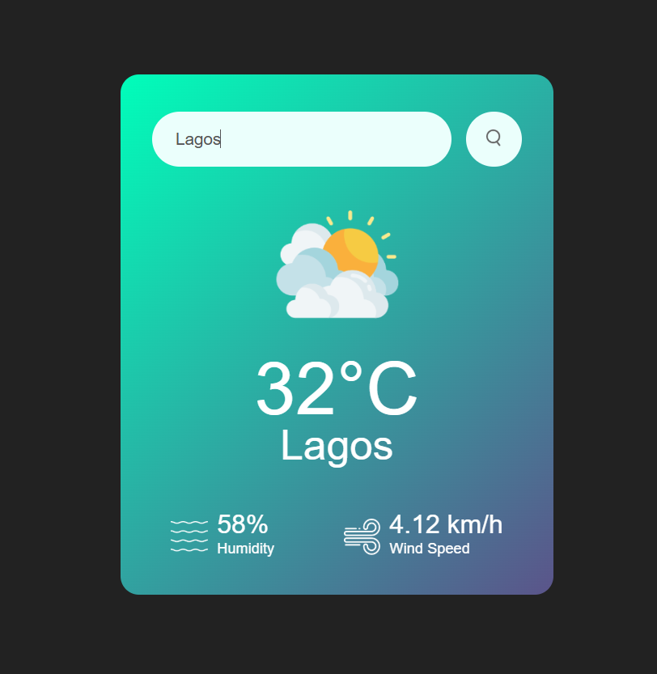

# Real-Time Weather Update with HONO

A simple web application that provides real-time weather updates based on user-inputted Location, Country, or city names.
## Project Screenshot


## Prerequisites

- [Deno] – A secure and modern runtime for JavaScript and TypeScript
- [Hono] v2.2.0 or higher (Deno Framework) – A lightweight and fast web framework for handling server-side routing.
- [OpenWeatherMapAPI] – Used to fetch real-time weather data.
- [HTML, CSS, and JavaScript] – For the frontend UI, including a responsive design.


## Installation

1. Clone full repository:

```bash
git clone GitHub.com/adedayo-lab/Hono-weather-app
```

2. Things to put into consideration

```

Dependency	                        Purpose
Hono v2.2.0               	        Web framework for routing
Hono Middleware (serve static)	      Serves static files (CSS, images)
OpenWeatherMap API	                Fetches real-time weather data
Google Fonts (Poppins)            	Improves UI styling


```


# Running the Project

Start the server by running:

```bash
deno run --allow-net --allow-read app.ts
```

The server will start on `http://localhost:8000`

## API Endpoints
For [app.ts] None was used as it ran directly from OPenWeather

```
/api/weather/:city
```
Fetches weather details for a city

### Example of API Endpoint from OpenWeatherMap

- [GET] http://localhost:8000/api/weather/Lagos

```json
{
  "name": "Lagos",
  "main": {
    "temp": 30,
    "humidity": 70
  },
  "wind": {
    "speed": 10
  },
  "weather": [
    {
      "main": "Clear",
      "description": "clear sky"
    }
  ]
}

```


```bash
curl -X GET http://localhost:8000/api/weather/Lagos
```

### Project Structure

```
📂 Hono-weather-app  
│── 📂 public/                  
│   ├── 📂 style/               
│   │   ├── 📄 style.css        
│   ├── 📂 images/              
│   │   ├── clear.png  
│   │   ├── clouds.png  
│   │   ├── drizzle.png  
│   │   ├── humidity.png  
│   │   ├── mist.png  
│   │   ├── rain.png  
│   │   ├── search.png  
│   │   ├── wind.png  
│   ├── 📄 weather_Fav.gif      
│── 📄 app.ts                    
│── 📄 import_map.json          
│── 📄 deno.json 
│── 📄 deno.lock  
│── 📄 WebAppScreenshot.png                


```

## Error Responses

The API returns appropriate HTTP status codes:

- 200: Success
- 201: Resource created
- 404: Resource not found
- 400: Bad request

#  Contributing

1. Fork the repository
2. Create your feature branch (`git checkout -b feature/amazing-feature`)
3. Commit your changes (`git commit -m 'feat: add amazing feature'`)
4. Push to the branch (`git push origin feature/amazing-feature`)
5. Open a Pull Request
